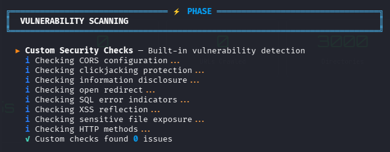
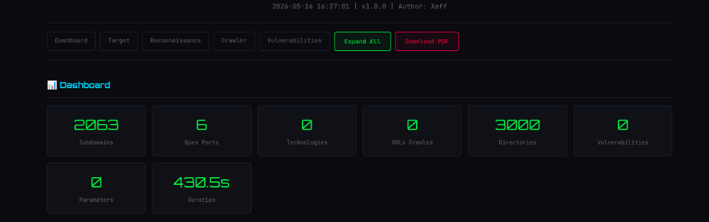

<p align="center">
  
</p>

<p align="center">
  
  
  
  
  
</p>

<p align="center">
  <b>🔱 Automated Reconnaissance & Vulnerability Scanner</b><br>
  <i>Give it a target. Get a full security assessment. Download a PDF report.</i>
</p>

<p align="center">
  <a href="#-quick-start-first-time-setup">Quick Start</a> •
  <a href="#-usage-examples">Usage</a> •
  <a href="#-features-at-a-glance">Features</a> •
  <a href="#-output--reports">Reports</a> •
  <a href="#-troubleshooting">Troubleshooting</a>
</p>

---

## 📸 Preview

<details>
<summary>🖥️ CLI — Hacker-Themed Terminal Output (click to expand)</summary>
<br>

```
    ____                        __ __  ______
   / __ \___  _________  ____  / // / /__  __/
  / /_/ / _ \/ ___/ __ \/ __ \/ // /_   / /
 / _, _/  __/ /__/ /_/ / / / /__  __/  / /
/_/ |_|\___/\___/\____/_/ /_/  /_/    /_/

  ═══════════════════════════════════════════
  🔱 Automated Recon & Vulnerability Scanner
  Version 1.0.0 | Author: Xaff
  ═══════════════════════════════════════════
```



</details>

<details>
<summary>📊 HTML Report — Interactive Dashboard (click to expand)</summary>
<br>



</details>

---

## ⚡ Quick Start (First-Time Setup)

> **Designed for Kali Linux** — works out of the box with virtual environments.

### Step 1: Clone & Setup

```bash
git clone https://github.com/zafor-hridoy/recon47.git
cd recon47
chmod +x setup.sh && ./setup.sh
```

### Step 2: Activate & Run

```bash
source venv/bin/activate
python3 recon47.py -t scanme.nmap.org
```

### Step 3: View Report

```bash
firefox recon47_output/*/report.html
```

> 💡 **PDF Download:** Click the **"Download PDF"** button inside the HTML report.

<details>
<summary>📋 Manual Setup (if setup.sh doesn't work)</summary>

```bash
git clone https://github.com/zafor-hridoy/recon47.git
cd recon47

# Create virtual environment (required on Kali Linux)
python3 -m venv venv
source venv/bin/activate

# Install dependencies
pip install -r requirements.txt

# Install SecLists (if not already on your system)
sudo apt install seclists
# OR
git clone --depth 1 https://github.com/danielmiessler/SecLists.git ~/SecLists

# Run
python3 recon47.py -t example.com
```

</details>

---

## 🚀 Usage Examples

```bash
# Basic scan
python3 recon47.py -t example.com

# Scan an IP address
python3 recon47.py -t 192.168.1.1

# Scan a full URL
python3 recon47.py -t https://target.com

# Full scan with external tools
python3 recon47.py -t example.com --nikto --nuclei

# Stealth mode (slower, evasive scanning)
python3 recon47.py -t example.com --stealth

# Custom threads and depth
python3 recon47.py -t example.com --threads 20 --depth 5

# Skip specific phases
python3 recon47.py -t example.com --skip-crawl --skip-vuln

# Show help
python3 recon47.py -h
```

---

## ✨ Features at a Glance

<table>
<tr>
<td width="50%">

### 🔍 Reconnaissance
- **WHOIS** — Registration, registrar, dates
- **DNS** — A, AAAA, CNAME, MX, NS, TXT, SOA, PTR
- **Subdomains** — 6 passive sources + SecLists brute-force
- **Ports** — Nmap top 1000 with banner grabbing
- **Tech Detection** — 30+ technologies (WAF bypass)
- **Header Audit** — 8 security headers + cookies

</td>
<td width="50%">

### 🕷️ Crawling & Discovery
- **Web Crawler** — Recursive BFS with depth control
- **Dir Bruteforce** — SecLists (3000 paths)
- **JS Analysis** — API keys, secrets, endpoints
- **Param Extraction** — URL + form field mining

</td>
</tr>
<tr>
<td>

### ⚡ Vulnerability Scanning
- **9 Built-in Checks:**
  - CORS misconfiguration
  - Clickjacking (X-Frame-Options)
  - XSS reflection
  - SQL error detection
  - Open redirect
  - Sensitive file exposure
  - HTTP methods (PUT/DELETE)
  - Information disclosure
  - Missing security headers
- **Nikto** integration (optional)
- **Nuclei** integration (optional)

</td>
<td>

### 📊 Reporting
- **HTML Report** — Dark hacker theme
  - Severity donut chart
  - Expandable sections
  - 🔴 Red rows = internal IPs
  - 🟡 Amber rows = dev/admin/staging
  - Smart hacker-priority sorting
  - One-click PDF download
- **JSON Export** — Machine-readable

</td>
</tr>
</table>

---

## 🔗 Subdomain Sources (6 Passive + Active)

| # | Source | Type |
|---|--------|------|
| 1 | **crt.sh** | Certificate Transparency logs |
| 2 | **HackerTarget** | DNS search API |
| 3 | **RapidDNS** | DNS database |
| 4 | **AlienVault OTX** | Threat intelligence |
| 5 | **URLScan.io** | Web scanning archive |
| 6 | **Anubis-DB** | Subdomain database |
| 7 | **SecLists DNS** | Active brute-force (5000 words) |

---

## 📖 CLI Options

```
usage: recon47.py [-h] -t TARGET [-o OUTPUT] [--threads N] [--timeout N]
                  [--depth N] [--rate-limit N]
                  [--skip-recon] [--skip-crawl] [--skip-vuln]
                  [--nikto] [--nuclei] [--stealth] [-v] [--no-banner]
```

| Flag | Description | Default |
|------|-------------|---------|
| `-t, --target` | Target domain, URL, or IP | **Required** |
| `-o, --output` | Output base directory | `recon47_output` |
| `--threads` | Number of threads | `10` |
| `--timeout` | Request timeout (seconds) | `15` |
| `--depth` | Crawler depth | `3` |
| `--rate-limit` | Max requests/second | `15` |
| `--skip-recon` | Skip reconnaissance phase | — |
| `--skip-crawl` | Skip crawling phase | — |
| `--skip-vuln` | Skip vulnerability scanning | — |
| `--nikto` | Enable Nikto scanner | — |
| `--nuclei` | Enable Nuclei scanner | — |
| `--stealth` | Stealth mode (random delays) | — |
| `-v, --verbose` | Verbose output | — |
| `--no-banner` | Suppress ASCII banner | — |
| `-h, --help` | Show help message | — |

---

## 📊 Output & Reports

Each scan creates a **unique timestamped folder** — reports never overwrite:

```
recon47_output/
├── bestbuy_com_20260517_030000/
│   ├── report.html          ← Interactive HTML report
│   └── results.json         ← Machine-readable JSON
├── scanme_nmap_org_20260517_031500/
│   ├── report.html
│   └── results.json
```

### HTML Report Highlights
- 🎨 **Dark "Cyber Matrix" theme** with animated scanline
- 📊 **Dashboard** with live statistics and severity donut chart
- 🔴 **Red-highlighted rows** — subdomains with internal IPs (10.x, 192.168.x, 172.x)
- 🟡 **Amber-highlighted rows** — interesting targets (admin, dev, staging, vpn, api)
- 📂 **Smart sorting** — most vulnerable/interesting findings always on top
- 📥 **One-click PDF download**
- 🔍 **Expand All** button for deep inspection

---

## 🏗️ Architecture

```
recon47/
├── recon47.py                 # CLI entry point
├── setup.sh                   # One-command Kali setup
├── requirements.txt           # Python dependencies
├── core/
│   ├── engine.py              # Scan orchestrator
│   ├── config.py              # Config + top 1000 ports
│   ├── logger.py              # Rich console output
│   ├── validator.py           # Input validation
│   └── seclists.py            # SecLists manager
└── modules/
    ├── recon/                 # 6 recon modules
    ├── crawler/               # 4 discovery modules
    ├── scanners/              # 3 vuln scanner modules
    └── report/                # HTML + JSON generators
```

### Scan Pipeline

```
┌─────────────────────────────────────────────────────────────┐
│                    TARGET INPUT                              │
│           (domain / URL / IP address)                        │
└─────────────┬───────────────────────────────────────────────┘
              ▼
┌─────────────────────────────────────────────────────────────┐
│  VALIDATION → HTTP/HTTPS Probe → SecLists Init              │
└─────────────┬───────────────────────────────────────────────┘
              ▼
┌─────────────────────────────────────────────────────────────┐
│  Phase 1: RECONNAISSANCE                                     │
│  WHOIS → DNS → Subdomains (2000+) → Ports (1000) → Tech     │
│  → Headers                                                   │
└─────────────┬───────────────────────────────────────────────┘
              ▼
┌─────────────────────────────────────────────────────────────┐
│  Phase 2: CRAWLING & DISCOVERY                               │
│  Crawler → Dir Bruteforce (3000) → JS Analysis → Params     │
└─────────────┬───────────────────────────────────────────────┘
              ▼
┌─────────────────────────────────────────────────────────────┐
│  Phase 3: VULNERABILITY SCANNING                             │
│  9 Custom Checks → Nikto (opt) → Nuclei (opt)               │
└─────────────┬───────────────────────────────────────────────┘
              ▼
┌─────────────────────────────────────────────────────────────┐
│  Phase 4: REPORTING                                          │
│  Statistics → JSON Export → HTML Report (with PDF download)  │
└─────────────────────────────────────────────────────────────┘
```

---

## 🔧 Optional: External Scanners

```bash
# Nikto (usually pre-installed on Kali)
sudo apt install nikto

# Nuclei
go install -v github.com/projectdiscovery/nuclei/v3/cmd/nuclei@latest
```

---

## 🐳 Docker (Alternative)

```bash
docker build -t recon47 .
docker run --rm -v $(pwd)/output:/app/recon47_output recon47 -t example.com
```

---

## ❓ Troubleshooting

<details>
<summary><b>"externally-managed-environment" error on Kali</b></summary>

Always use a virtual environment:
```bash
python3 -m venv venv
source venv/bin/activate
pip install -r requirements.txt
```
</details>

<details>
<summary><b>Technology Detection / Header Analysis times out</b></summary>

Some sites (BestBuy, Amazon) use aggressive WAFs (Akamai, Cloudflare) that block even browser-like requests. This is expected — the tool still collects subdomains, ports, DNS, and WHOIS data. Try a different target.
</details>

<details>
<summary><b>"SecLists not found" warning</b></summary>

```bash
sudo apt install seclists          # Kali/Debian
# OR
git clone --depth 1 https://github.com/danielmiessler/SecLists.git ~/SecLists
```
</details>

<details>
<summary><b>Scan is slow</b></summary>

- Port scanning 1000 ports takes ~60s depending on the target
- Skip phases: `--skip-recon` or `--skip-crawl`
- Increase threads: `--threads 30`
</details>

---

## 🛡️ Ethical Safeguards

- ⚠️ Authorization disclaimer on every scan
- 🔒 Rate-limiting (15 req/s default)
- 🚫 Read-only checks — no destructive payloads
- 🎭 User-Agent rotation
- 📝 All activities timestamped

---

## ⚠️ Legal Disclaimer

> **This tool is intended for authorized security testing only.**
> Only scan targets you have **explicit written permission** to test.
> The author assumes **no liability** for misuse of this tool.

---

<p align="center">
  <b>Built with ❤️ by Xaff</b><br>
  <sub>🔱 Recon47 — See everything. Miss nothing.</sub>
</p>
