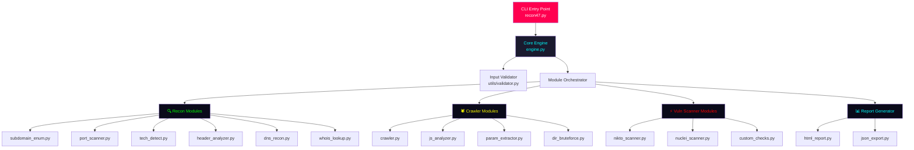

# 🔱 Recon47 — Product Requirements Document (PRD)

> **Tool Name:** Recon47  
> **Author:** Xaff  
> **Version:** 1.0.0  
> **Language:** Python 3.10+  
> **Type:** CLI-based Automated Reconnaissance & Vulnerability Scanner

---

## 1. Executive Summary

Recon47 is a production-ready, modular, CLI-based automated reconnaissance and vulnerability scanning tool designed for penetration testers and security researchers. It accepts a domain, subdomain, URL, or IP address and performs a comprehensive security assessment — from passive/active recon to vulnerability scanning — then generates a stunning hacker-themed HTML report.

---

## 2. Architecture Overview



---

## 3. Module Breakdown

### 3.1 Core Modules (Required)

| Module | File | Description |
|--------|------|-------------|
| **CLI Interface** | `recon47.py` | argparse-based entry point, banner display, orchestration |
| **Core Engine** | `core/engine.py` | Orchestrates all modules, manages scan state |
| **Input Validator** | `core/validator.py` | Validates domain/IP/URL input, normalizes targets |
| **Config Manager** | `core/config.py` | Central configuration, timeouts, API keys |
| **Logger** | `core/logger.py` | Custom colored console output with severity levels |

### 3.2 Reconnaissance Modules

| Module | File | Technique |
|--------|------|-----------|
| **Subdomain Enumeration** | `modules/recon/subdomain_enum.py` | crt.sh, SecurityTrails API, brute-force with wordlist |
| **Port Scanner** | `modules/recon/port_scanner.py` | TCP SYN/connect scan on top ports, service detection |
| **Technology Detection** | `modules/recon/tech_detect.py` | HTTP headers, meta tags, script analysis (Wappalyzer-style) |
| **Header Analyzer** | `modules/recon/header_analyzer.py` | Security header audit (HSTS, CSP, X-Frame, etc.) |
| **DNS Recon** | `modules/recon/dns_recon.py` | A, AAAA, MX, NS, TXT, CNAME, SOA records |
| **WHOIS Lookup** | `modules/recon/whois_lookup.py` | Domain registration, registrar, expiry dates |

### 3.3 Crawler Modules

| Module | File | Technique |
|--------|------|-----------|
| **Web Crawler** | `modules/crawler/crawler.py` | Recursive crawling with depth control, link extraction |
| **JS Analyzer** | `modules/crawler/js_analyzer.py` | Extract JS files, find endpoints/secrets in JS |
| **Parameter Extractor** | `modules/crawler/param_extractor.py` | Query params, form fields, hidden inputs |
| **Directory Bruteforce** | `modules/crawler/dir_bruteforce.py` | Common dirs/files discovery with wordlist |

### 3.4 Vulnerability Scanner Modules

| Module | File | Technique |
|--------|------|-----------|
| **Nikto Scanner** | `modules/scanners/nikto_scanner.py` | Wraps nikto CLI, parses output |
| **Nuclei Scanner** | `modules/scanners/nuclei_scanner.py` | Wraps nuclei CLI, parses JSON output |
| **Custom Checks** | `modules/scanners/custom_checks.py` | XSS reflection, open redirect, SQL error, CORS, CSRF, clickjacking, info disclosure |

### 3.5 Reporting Modules

| Module | File | Format |
|--------|------|--------|
| **HTML Report** | `modules/report/html_report.py` | Hacker-themed HTML with charts, severity badges |
| **JSON Export** | `modules/report/json_export.py` | Machine-readable structured JSON |

---

## 4. CLI Interface Design

```
usage: recon47.py [-h] -t TARGET [-o OUTPUT] [--threads THREADS]
                  [--timeout TIMEOUT] [--depth DEPTH]
                  [--ports PORTS] [--rate-limit RATE]
                  [--skip-recon] [--skip-crawl] [--skip-vuln]
                  [--nikto] [--nuclei] [--stealth]
                  [-v] [--no-banner]

🔱 Recon47 v1.0.0 — Automated Recon & Vulnerability Scanner by Xaff

Required:
  -t, --target TARGET     Target domain, URL, or IP address

Options:
  -o, --output OUTPUT     Output directory (default: ./recon47_output)
  --threads THREADS       Number of threads (default: 10)
  --timeout TIMEOUT       Request timeout in seconds (default: 10)
  --depth DEPTH           Crawler depth (default: 3)
  --ports PORTS           Port range (default: top-100)
  --rate-limit RATE       Requests per second limit (default: 15)
  --skip-recon            Skip reconnaissance phase
  --skip-crawl            Skip crawling phase
  --skip-vuln             Skip vulnerability scanning
  --nikto                 Enable Nikto scanning
  --nuclei                Enable Nuclei scanning
  --stealth               Enable stealth mode (slower, evasive)
  -v, --verbose           Verbose output
  --no-banner             Suppress banner
```

---

## 5. Console Output Design

The tool uses Rich library for terminal output:

- **Banner**: ASCII art with gradient colors
- **Phase Headers**: Boxed section titles with icons
- **Progress**: Live progress bars for long operations
- **Tables**: Rich tables for structured data
- **Status**: Color-coded status indicators (✓ green, ✗ red, ⚠ yellow, ℹ blue)
- **Panels**: Boxed summaries per module

---

## 6. HTML Report Design

### Theme: "Cyber Matrix" — Dark hacker aesthetic

- **Color Palette**: 
  - Background: `#0a0a0f` (near-black)
  - Primary: `#00ff41` (matrix green)
  - Accent: `#ff0050` (neon red for critical)
  - Secondary: `#00d4ff` (cyber blue)
  - Warning: `#ffaa00` (amber)
- **Typography**: JetBrains Mono (monospace), Orbitron (headings)
- **Features**:
  - Animated scan lines / glitch effects
  - Severity badge pills (CRITICAL/HIGH/MEDIUM/LOW/INFO)
  - Expandable/collapsible sections
  - Summary dashboard with statistics
  - Chart.js donut chart for vulnerability severity distribution
  - Responsive design
  - Print-friendly mode
  - Timestamp and scan metadata header
  - Table of contents with anchor links

---

## 7. Bonus Features Implemented

| Feature | Implementation |
|---------|----------------|
| ✅ Recursive crawling | Depth-controlled BFS crawler |
| ✅ Multi-threading | ThreadPoolExecutor across all modules |
| ✅ Smart deduplication | URL normalization + set-based dedup |
| ✅ HTML report | Full hacker-themed report with charts |
| ✅ Stealth scanning | Rate-limiting, random User-Agents, jitter |
| ✅ Advanced attack surface | JS secret extraction, parameter mining |
| ✅ Docker support | Dockerfile + docker-compose.yml |

---

## 8. Project Structure

```
recon47/
├── recon47.py                    # Main entry point
├── requirements.txt              # Dependencies
├── Dockerfile                    # Docker support
├── docker-compose.yml            # Docker compose
├── README.md                     # Documentation
├── wordlists/
│   ├── subdomains.txt            # Subdomain wordlist
│   └── directories.txt           # Directory wordlist
├── core/
│   ├── __init__.py
│   ├── engine.py                 # Scan orchestrator
│   ├── config.py                 # Configuration
│   ├── logger.py                 # Console output handler
│   └── validator.py              # Input validation
├── modules/
│   ├── __init__.py
│   ├── recon/
│   │   ├── __init__.py
│   │   ├── subdomain_enum.py
│   │   ├── port_scanner.py
│   │   ├── tech_detect.py
│   │   ├── header_analyzer.py
│   │   ├── dns_recon.py
│   │   └── whois_lookup.py
│   ├── crawler/
│   │   ├── __init__.py
│   │   ├── crawler.py
│   │   ├── js_analyzer.py
│   │   ├── param_extractor.py
│   │   └── dir_bruteforce.py
│   ├── scanners/
│   │   ├── __init__.py
│   │   ├── nikto_scanner.py
│   │   ├── nuclei_scanner.py
│   │   └── custom_checks.py
│   └── report/
│       ├── __init__.py
│       ├── html_report.py
│       └── json_export.py
└── output/                       # Default output directory
```

---

## 9. Dependencies

```
requests>=2.31.0
dnspython>=2.4.0
python-whois>=0.8.0
beautifulsoup4>=4.12.0
rich>=13.7.0
urllib3>=2.0.0
```

---

## 10. Ethical Safeguards

- Clear disclaimer on startup
- Authorization confirmation prompt (can be bypassed with `--yes` flag)
- Rate-limiting by default (15 req/s)
- No destructive payloads
- Logging of all scan activities

---

## 11. Implementation Priority

1. **Phase 1**: Core infrastructure (CLI, engine, logger, validator, config)
2. **Phase 2**: Reconnaissance modules (all 6)
3. **Phase 3**: Crawler modules (all 4)
4. **Phase 4**: Vulnerability scanners (nikto, nuclei, custom)
5. **Phase 5**: Report generation (HTML + JSON)
6. **Phase 6**: Bonus features (threading, stealth, Docker)
7. **Phase 7**: Documentation & polish
